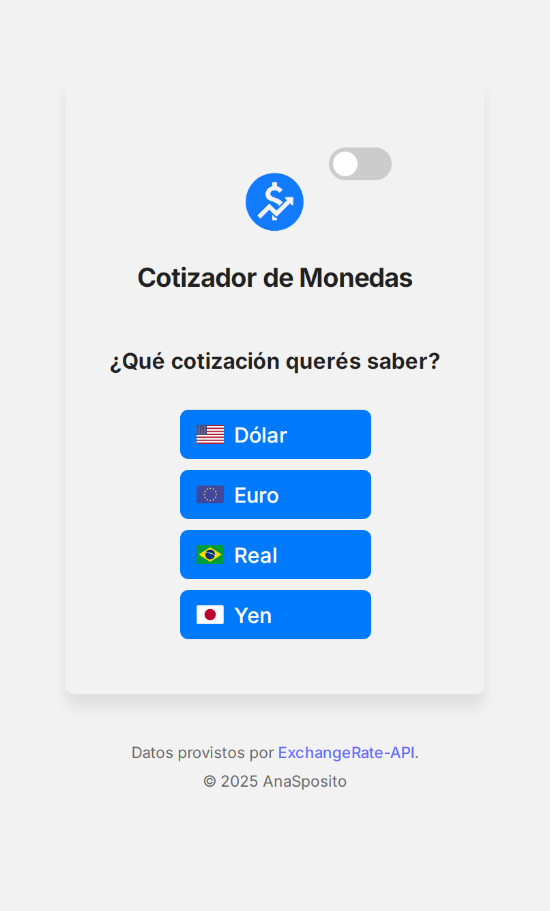
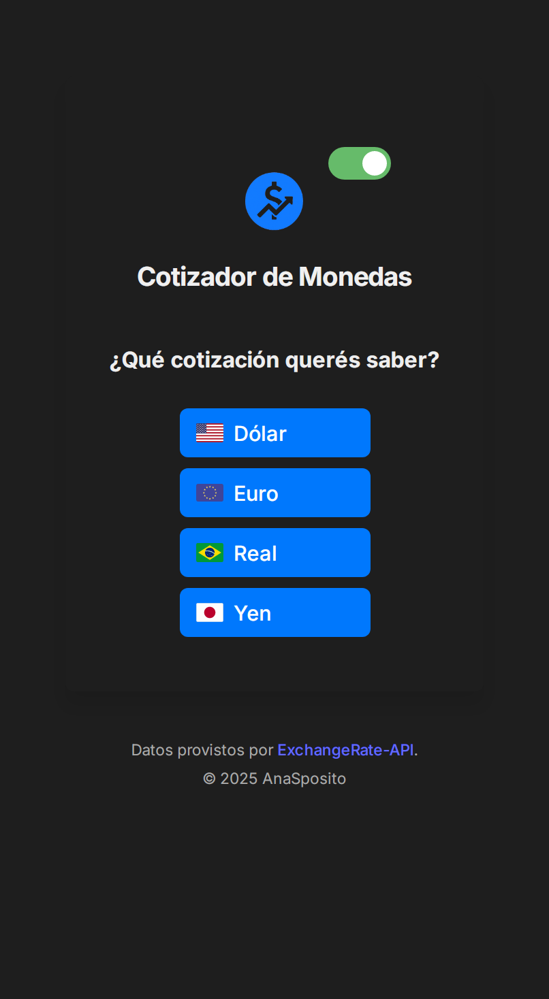

# Cotizador de Monedas

Aplicación web para consultar el tipo de cambio actualizado de distintas divisas, con un diseño accesible, responsivo y compatibilidad con modo claro/oscuro.

---

## 🌐 Demo en vivo

[ Ver la app publicada](https://cotizador-ana.netlify.app/)

---

##  Capturas de pantalla

### Pantalla grande

**Modo claro**  


**Modo oscuro**  


### Pantalla móvil

**Modo claro**  


**Modo oscuro**  


---

## ⚙️ Tecnologías utilizadas

- React
- Vite
- CSS personalizado con variables y temas
- Netlify (Deploy)
- ExchangeRate API

---

## ✨ Funcionalidades destacadas

- Cambio dinámico de tema claro/oscuro con persistencia
- Diseño adaptativo para distintos dispositivos
- Visualización de cotizaciones actualizadas con fecha
- Animaciones sutiles y estética profesional

---

##  Instalación local

```bash
git clone https://github.com/tunombre/cotizador-moneda.git
cd cotizador-moneda
npm install
npm run dev
